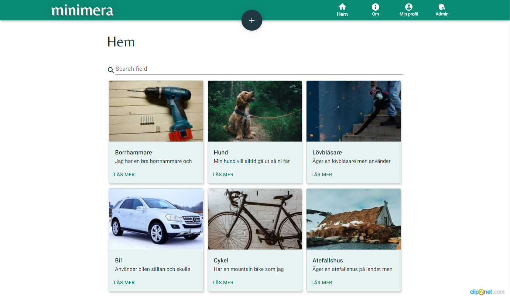
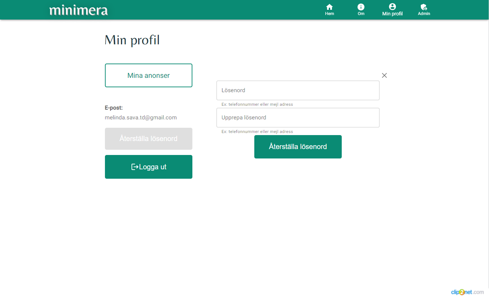
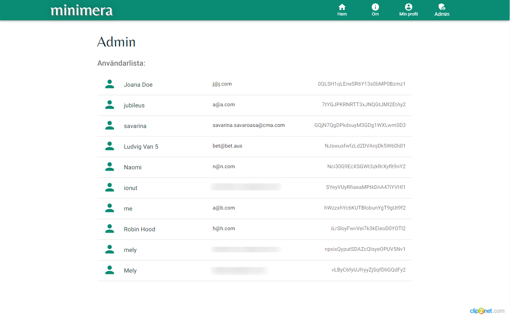
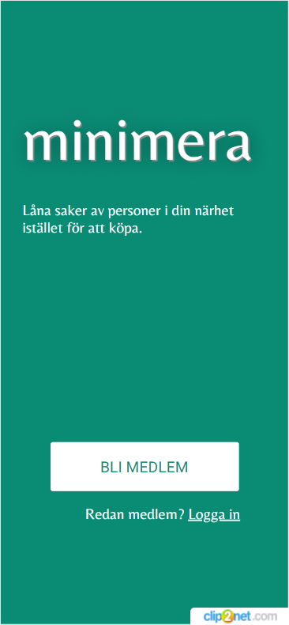
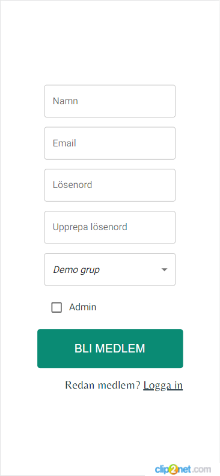
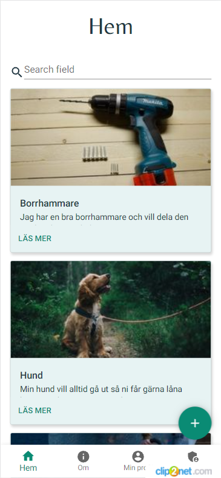
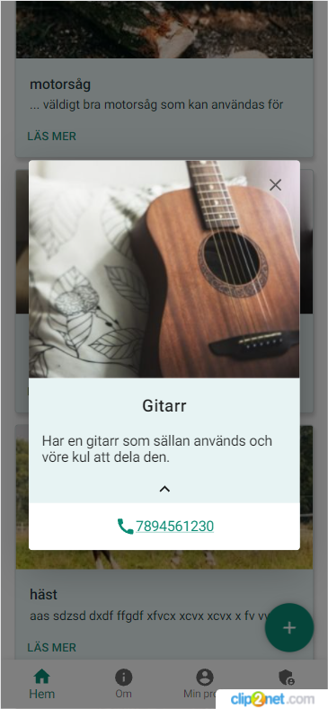
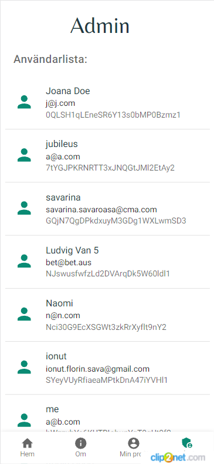
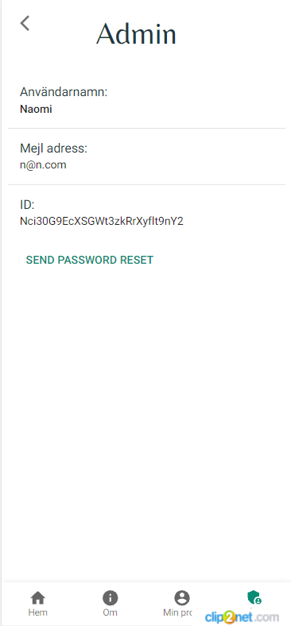

# minimera
Minimera är en applikation som fokuserar på att främja mer återanvändande och delning av saker som kanske används sällan av sina ägare men som det finns behov av i samhället.

## Table of contents
* [**UX**](#ux)  
* [**Screenshots**](#screenshots)
* [**Features**](#features)
* [**Future-Features**](#future-features)
* [**Technologies**](#technologies)
* [**Links**](#links)

## UX
Gruppens UX Review visade att fölk var intresserade av möjligheten av att kunna låna från personer i geografisk närhet men att de hade svårt att låna till vem som helst och önskade se namn eller betyg på andra användare. Många ville ha en begränsad lånetid och få notis innan deadline.
Folk okså ville gärna:
- Låna saker som är för dyra att köpa och används sällan. 
- Inte låna ut ömtåliga eller dyra saker.
- Dela kostnaden med andra (gemensamt ägande) så att man kan investera i saker 
gemensamt.

## Screenshots

 

     

## Features
* Inloggning med namn, mail och lösenord (Firebase Authentication)
* Inloggade användare sparas
* Admin roller (Firebase Authorisation)
* Lösenordsåterställning
* Mejl verifikation
* Vy med gruppens annonser
* Skapa annons med titel och beskrivning
* Radera eller redigera anons
* Konto vy med egna anonser och lösenord byt
* Admin vy med gruppens deltagare 
* Admin vy med deltagarens detaljer och möjlighet att skicka lösenordsåterställning 

## Future-Features
* Kunna lägga till bilder i annonser
* BankID för inloggning
* Kalenderfunktion med tidsbegränsning
* Recensioner/betyg på användare
* Chattfunktion
* Skapa egna grupper
* Sökfunktion för användare och grupper 
* Visa användarens namn
* Kategorier

## Technologies
* React
* Firebase
* Styled Components
* Material Design

## Links
[Prototype](https://www.figma.com/proto/MXs67a7X6klRmHE9auf2gR/teamprojekt-3-riktiga-figman?node-id=102%3A2&scaling=scale-down&page-id=0%3A1&starting-point-node-id=102%3A2)  
[Circular economy google doc](https://docs.google.com/document/d/1DPPQYTi_M_Vg2JRuyIxPTRpBPZIgiAWZogmuiUR4Mo0/edit?usp=sharing)  
[Trello Scrumboard](https://trello.com/b/TeVvQq2w/)  
[Idea board](https://ideaboardz.com/for/Cirkul%C3%A4r%203/4061359)  
[Survey](https://docs.google.com/forms/d/1Nip0TFxusobZgY4oZTIfVype6Yrd2FOaZCgiUbU_Ezo/edit)  
[Slides](https://docs.google.com/presentation/d/1zd6kyqf3MVkFf39yClkCc9Zy6RSK7x5-yLrUWIt7pdY/edit?usp=sharing)  
