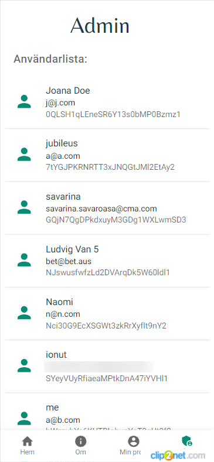

# minimera
Minimera är en applikation som fokuserar på att främja mer återanvändande och delning av saker som kanske används sällan av sina ägare men som det finns behov av i samhället.

## Table of contents
* [**UX**](#ux)  
* [**Screenshots**](#screenshots)
* [**Features**](#features)
* [**Future-Features**](#future-features)
* [**Technologies**](#technologies)
* [**Start project**](#start-project)
* [**Links**](#links)

## UX
Gruppens UX Review visade att fölk var intresserade av möjligheten av att kunna låna från personer i geografisk närhet men att de hade svårt att låna till vem som helst och önskade se namn eller betyg på andra användare. Många ville ha en begränsad lånetid och få notis innan deadline.
Folk okså ville gärna:
- Låna saker som är för dyra att köpa och används sällan. 
- Inte låna ut ömtåliga eller dyra saker.
- Dela kostnaden med andra (gemensamt ägande) så att man kan investera i saker 
gemensamt.
För att tillgodose användarnas behov har vi implementerat:
- Inloggning med användarnamn, e-post och lösenord samt föreslagit vidareutveckling av Bank ID-inloggning
- Sök funktion
- Mer synlig lägg till knap
- Direkt kontakt med annönsör  

Dessutom har vi haft i åtanke flera användare behöv som [framtida funktioner av appen](#future-features).

## Screenshots


 

     


## Features
* Inloggning med namn, mail och lösenord (Firebase Authentication)
* Inloggade användare sparas
* Admin roller (Firebase Authorisation)
* Lösenordsåterställning
* Mejl verifikation
* Vy med gruppens annonser
* Skapa annons med titel och beskrivning
* Radera eller redigera anons
* Konto vy med egna anonser och lösenord byt
* Admin vy med gruppens deltagare 
* Admin vy med deltagarens detaljer och möjlighet att skicka lösenordsåterställning 

## Future-Features
* Kunna lägga till bilder i annonser
* BankID för inloggning
* Kalenderfunktion med tidsbegränsning
* Recensioner/betyg på användare
* Chattfunktion
* Skapa egna grupper
* Sökfunktion för användare och grupper 
* Visa användarens namn
* Kategorier

## Technologies
* React
* Firebase
* Styled Components
* Material Design

## Start project
1. Skapa en fil med nämnet config.js och lägg den i src/components/Firebase.
2. Skapa en Firebase projekt med Realtime Database [enligt dokumentationen](https://firebase.google.com/docs/database/web/start).
3. Initialisera Realtime Database JavaScript SDK genom att kompletera följande kod med uppgifterna från din Firebase projekt och lägga till de i config.js: 
``` 
const config = {
  apiKey: "din API nyckel",
  authDomain: "projektID.firebaseapp.com",
  databaseURL: "https://DinDatabasNamn.europe-west1.firebasedatabase.app",
  projectId: "projekt ID",
  storageBucket: "bucket.appspot.com",
  appId: "app ID",
  measurementId: "measurementId"
};

export default config; 
```
4. Spara och kör `npm run start` i terminalen.

## Links
[Prototype](https://www.figma.com/proto/MXs67a7X6klRmHE9auf2gR/teamprojekt-3-riktiga-figman?node-id=102%3A2&scaling=scale-down&page-id=0%3A1&starting-point-node-id=102%3A2)  
[Slides](https://docs.google.com/presentation/d/1zd6kyqf3MVkFf39yClkCc9Zy6RSK7x5-yLrUWIt7pdY/edit?usp=sharing) 
[Circular economy google doc](https://docs.google.com/document/d/1DPPQYTi_M_Vg2JRuyIxPTRpBPZIgiAWZogmuiUR4Mo0/edit?usp=sharing)  
[Trello Scrumboard](https://trello.com/b/TeVvQq2w/)  
[Idea board](https://ideaboardz.com/for/Cirkul%C3%A4r%203/4061359)  
[Survey](https://docs.google.com/forms/d/1Nip0TFxusobZgY4oZTIfVype6Yrd2FOaZCgiUbU_Ezo/edit)   
